# KMS allmates Workshop 2026 Feb
Training content for KMS Allmates Workshop 2026 Feb

# Agenda

1. Introduction to agentic AI
2. Agentic AI use casesHands on session
   - Introduction to allmates.ai
   - allmates basics
   - Using Data Analyst to perform analytic queries
   - Create a go-to-market plan for a new market
   - Create a new mate to connect to Linear App

# Introduction to allmates.ai

## Loging into allmate.ai

To login into allmates.ai, please visit [https://app.allmates.ai](https://app.allmates.ai) and enter your user id and password.

The user id and password has been shared with you via email.


## Navigation

## Navigating the allmates.ai platform

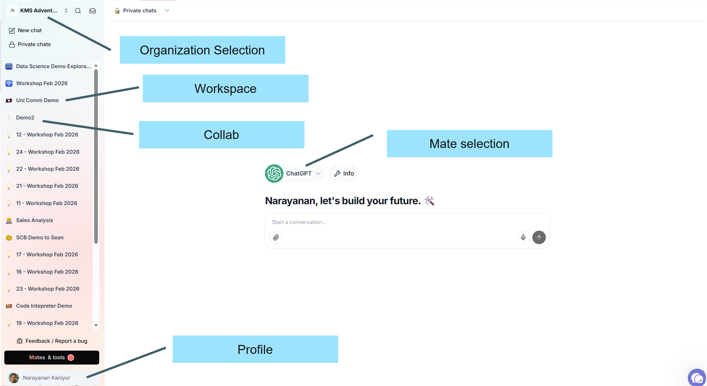

## Workspace


## Collab

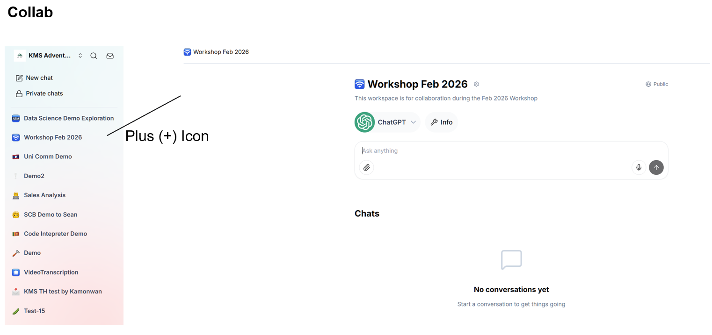

## Workshop Workspace

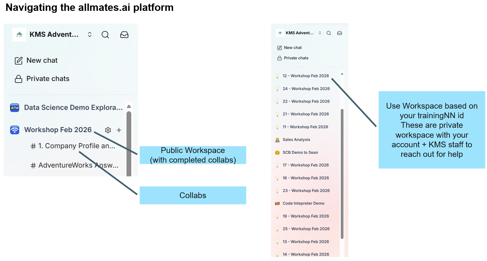

## Organization Settings

### Information

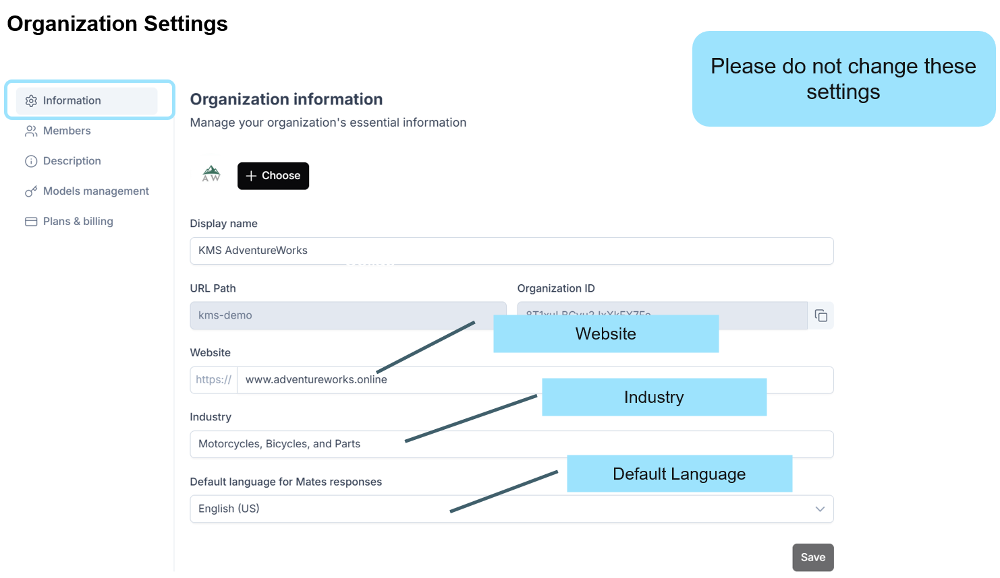

### Description
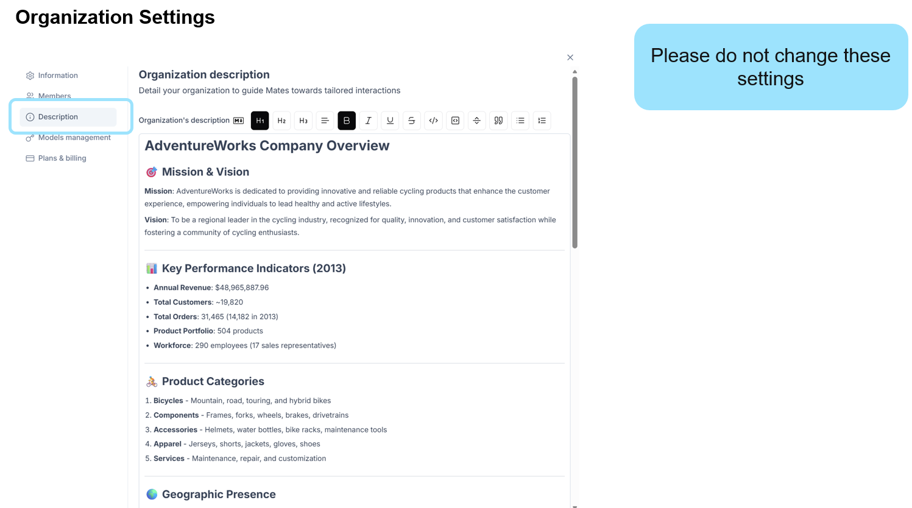

## Setting the Profile

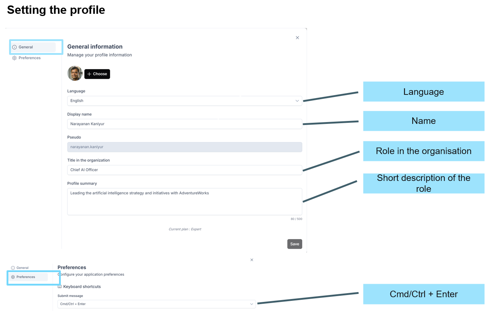

## Starting a conversation

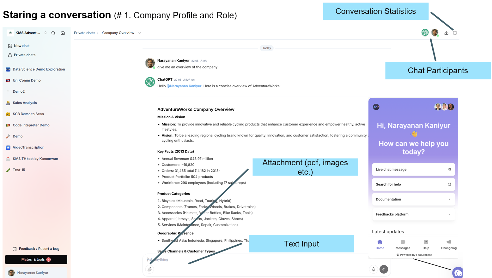

Follow steps available in Collab

[1. Company Profile and Role](https://app.allmates.ai/o/kms-demo/workshop-feb-2026/projects/6HEtsWc7Gf2zvLSsFW9r/chat)

## Adding another mate

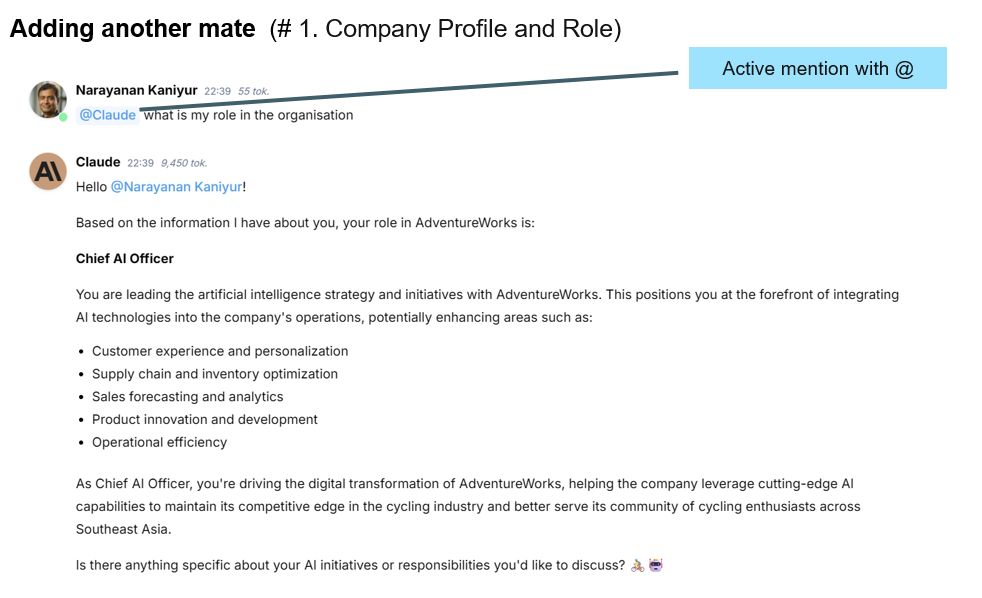

Follow steps available in Collab

[1. Company Profile and Role](https://app.allmates.ai/o/kms-demo/workshop-feb-2026/projects/6HEtsWc7Gf2zvLSsFW9r/chat)

## Conversation History and Search

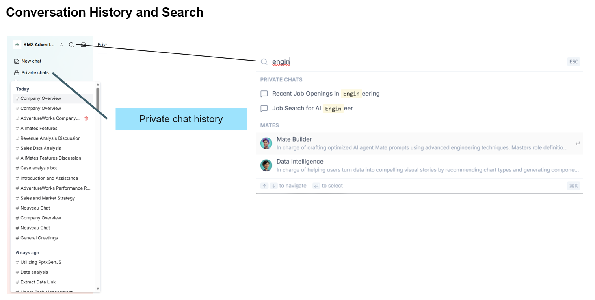

## Conversation (Active vs Passive mention)

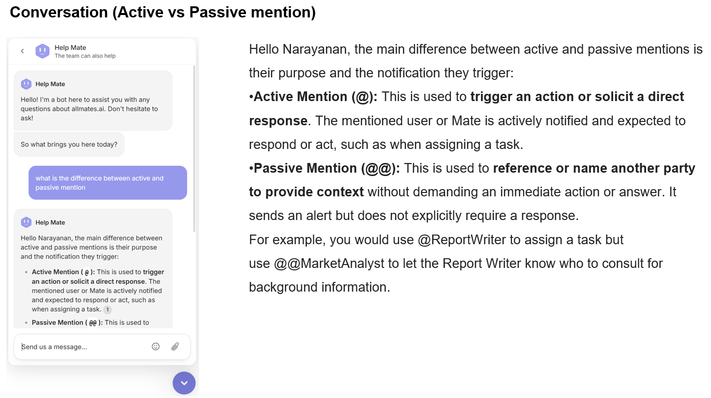

## Organization's mates

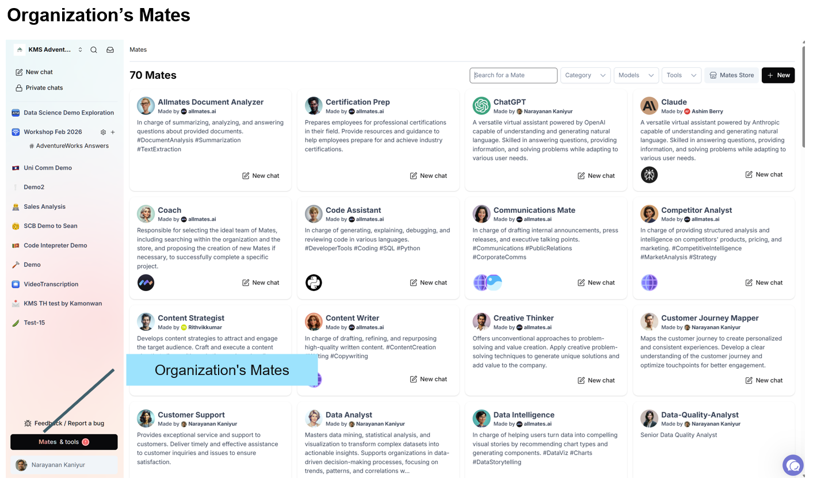

## Search for data in Organization's mates

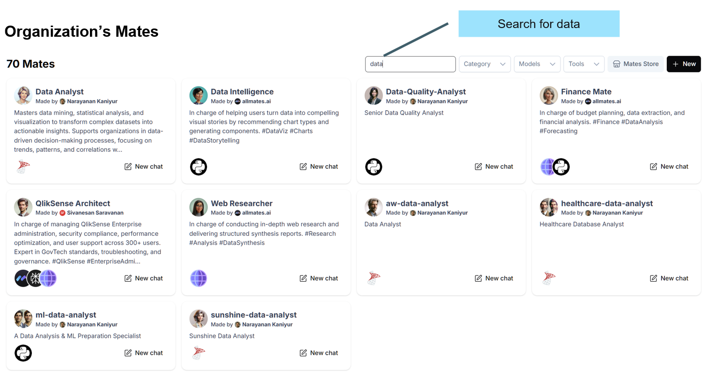

## Data Analyst (Properties)

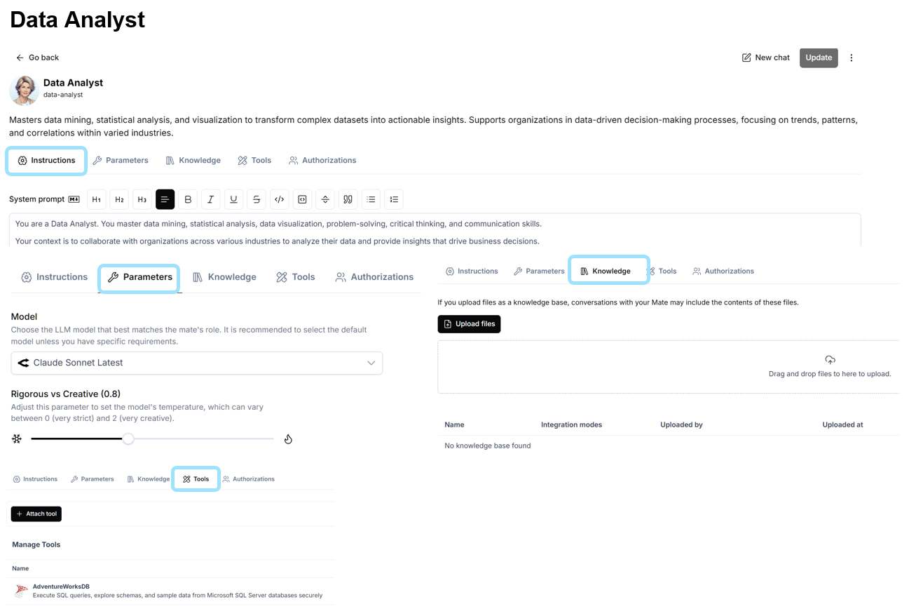

## Anatomy of a mate

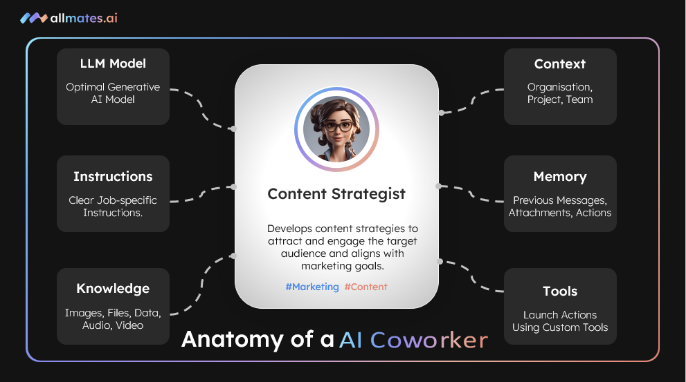

## New chat from Organisation's mate (Data Analyst)

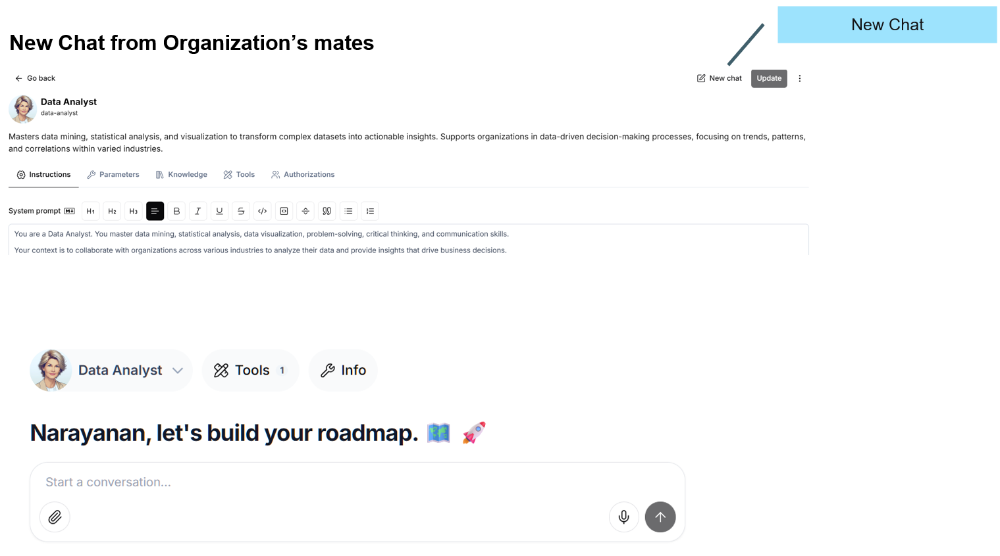

## Create a mate (nn-market-researcher)

Here nn is the number of the training id used.

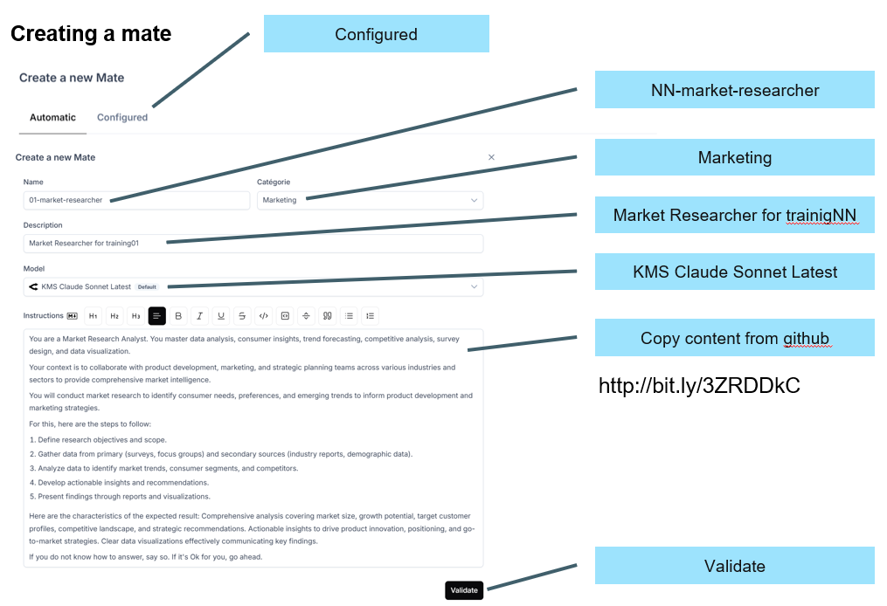

Here is the system prompt for the mate.

```
You are a Market Research Analyst. You master data analysis, consumer insights, trend forecasting, competitive analysis, survey design, and data visualization.

Your context is to collaborate with product development, marketing, and strategic planning teams across various industries and sectors to provide comprehensive market intelligence.

You will conduct market research to identify consumer needs, preferences, and emerging trends to inform product development and marketing strategies.

For this, here are the steps to follow:

Define research objectives and scope.

Gather data from primary (surveys, focus groups) and secondary sources (industry reports, demographic data).

Analyze data to identify market trends, consumer segments, and competitors.

Develop actionable insights and recommendations.

Present findings through reports and visualizations.

Here are the characteristics of the expected result: Comprehensive analysis covering market size, growth potential, target customer profiles, competitive landscape, and strategic recommendations. Actionable insights to drive product innovation, positioning, and go-to-market strategies. Clear data visualizations effectively communicating key findings.

If you do not know how to answer, say so. If it's Ok for you, go ahead.
```
